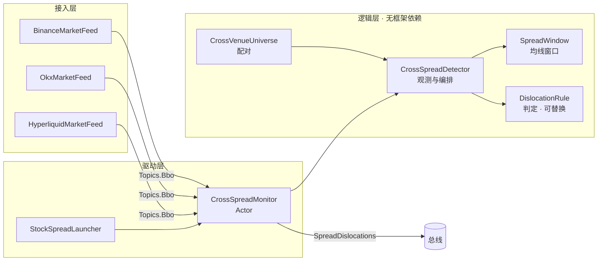

# 跨所股票永续价差监控

同时监听 Binance、OKX、Hyperliquid 三家交易所上的**股票永续合约**，在价差**突然大幅偏离
它自己近期中枢**时报警。当前只监控、不下单。

## 为什么"价差本身"不是信号

同一个标的在两家所之间长期存在价差，这是常态而不是机会：资金费率不同、参与者结构不同、
上市时间不同、做市深度不同，都会让某一家系统性地贵上几十个基点，而且能稳稳挂好几天。
照着它开仓，等来的不是回归而是持仓成本。

所以判据不是"价差有多大"，而是"**价差偏离它自己的中枢有多远**"。中枢由一个时间窗口的
均线给出，突然的偏离才是异动。

```
       价差 (bp)
        90 ┤                              ╭──────    ← 突然跳变: 这才是信号
           │                              │
        30 ┤──────────────────────────────╯          ← 结构性价差: 稳定存在, 不是信号
           │
         0 ┼──────────────────────────────────────→ 时间
              ←────── 均线窗口 ──────→
```

## 模块划分



职责边界只有一条：**逻辑层不碰框架，驱动层不含语义**。

- `CrossSpreadDetector` 管观测与编排（采样、推进时间、预热、断档、冷却），不管判定。
- `DislocationRule` 管判定，是本模块唯一的可替换件。纯函数：同一份读数必得同一个结论。
- `CrossSpreadMonitor` 管接线，检测语义一行都不在它里面。

因此全部逻辑用例（`CrossSpreadDetectorSpec`，17 条）脱离引擎、脱离时钟同步跑完。

## 价差怎么算

```
spread = 1e4 × ln(midA / midB)      单位 bp
```

取**对数比**而不是绝对差，有两个理由：

1. 相对量，不同价位的标的可比（300 美元的 AAPL 与 20 美元的某 ETF 用同一个阈值）。
2. 合约乘数差异（一张对一股还是十股）在对数下只是一个**常数偏置**，会被均线整个吸收，
   偏离量因此与乘数无关。取差再除以某一边则要先决定除以谁，两个方向给出的数还不一样。

用中间价而不是成交价：成交是稀疏且单边的，两所的最近一笔成交可能相隔很久、方向相反，
拿它们相减得到的"价差"里混着买卖价差与时间差。

## 判据

默认规则 `ZScoreRule` 要求两个条件**同时**成立：

| 条件 | 默认 | 防的是什么 |
|---|---|---|
| \|偏离\| / σ ≥ `minZ` | 5 | 正常波动 |
| \|偏离\| ≥ `minDeviationBps` | 15bp | 清淡时段报价钉死不动，σ 缩到接近 0，一次正常换价就打出几十个 σ —— 而那点偏离连手续费都不够 |

只看 z 会被前者放过，只看绝对值会把结构性价差大的标的的常态报成异动。

## 数据质量防线

监控三家所的行情，"看起来像异动"的假信号来路比真信号多。四道防线各挡一种：

| 防线 | 参数 | 挡的是 |
|---|---|---|
| 预热 | `minSamples` = 300 | 拿几十个样本估出来的中枢判"偏离"，报的是噪声 |
| 报价新鲜度 | `maxQuoteAgeMs` = 10s | 一腿停更、拿它配另一腿的实时报价，会把**对方的正常波动**算成价差异动 |
| 断档重置 | `resetGapMs` = 30s | 断档期间价差可能整体移位，拿断档前的中枢判当下，第一条样本几乎必然"大幅偏离" |
| 配对剔除 | `maxSpreadBps` = 2000bp，连续 `minSamples` 条 | 跨所代码撞名、或合约乘数不同 —— 那不是价差，是两个无关数字相减 |

最后一条的判据放在**价格**上而不是命名规则上：命名规则各所各改各的，价格骗不了人。

而它要求**连续**超限而不是一条就算：「这两个合约是不是同一个标的」是结构性事实，
就得用结构性证据去判。稀薄品种偶尔报一次极宽的盘口，拿它做一次**不可逆**的剔除，
等于一次坏报价永久丢掉一个价差对。真配错的一对每一条样本都超限，攒够只要一个预热的时间，
而那段时间里本来就不出信号。超限的样本一律不入窗——它不是一次可用的测量，
放进去会把中枢整个拖走。

每条报警都带 `quoteAgeMs`（两腿中较旧那条的年龄）与 `crossEdgeBps`（此刻对敲吃单能拿到的
原始价差），让人能判断这条信号背后是不是有一边其实快停更了、以及方向吃不吃得动。

## 标的宇宙

"这两个合约是同一个东西"不是框架能推出的事实 —— 各所的 `Symbol` 只保证在本所内唯一。

- **币安**与 **Hyperliquid** 各自能回答"这是传统资产永续吗"（`TRADIFI_PERPETUAL` /
  股票 dex），故由它们给出候选代码。
- **OKX** 的永续清单里加密与股票混在一起，只按代码加入前两者给出的候选。

命名判据只是第一道，最终防线在价格上（见上表的配对剔除）。

## 为什么监控器是 Actor 而不是 Strategy

用 `Strategy` 声明一个标的的行情，在本框架里就等于**交易**它：框架会独占登记
`(账户, 标的)`、补齐私有回报、做启动仓位对齐。而这里要同时盯三家所上百个标的、一个都不
下单 —— 走策略形态会把这些标的全部占住，之后任何真要交易它们的策略都起不来。

代价是它自己不会让行情流动起来，启动器要调 `Engine.watchMarket` 把盘口订上。
同一条取舍见 `strategy/scan/FlowScanner`。

装配上**没有柜台**：于是"能不能下单"是装配期的事实而不是运行期的自觉 —— 即使有人往里塞
一个会发下单指令的组件，指令也没有处理者，装配当场失败。

## Hyperliquid 接入

`HyperliquidMarketFeed` 走单条 `/ws` 连接，三类订阅：

| 框架订阅流 | HL 频道 |
|---|---|
| BBO | `bbo` |
| Trade | `trades` |
| MarkPrice / IndexPrice / FundingRate | `activeAssetCtx`（一条推送拆三个事件） |

两处不是随手写的：

- **心跳**：HL 服务端 60 秒收不到任何消息就断开，且不主动发 WS ping。故周期发应用层
  `{"method":"ping"}`，服务端回 `{"channel":"pong"}`，这条回帧同时喂饱了 `WsLoop` 的
  空闲看门狗。
- **流去重**：标记价/指数价/资金费率共用一条 `activeAssetCtx`。基类只按
  `SubscriptionKind` 去重，不在这一层再去一次重，同一条流会被订阅两三次，
  服务端以 error 报文拒绝 —— 而 error 在本实现里是致命的。

### dex 归属是边界上的必检项

HL 一个进程里同时存在多个 perp dex：默认 dex 的资产叫 `"BTC"`，builder 部署的（HIP-3）
叫 `"xyz:AAPL"`。框架 `Symbol` 取基础资产名，于是默认 dex 的 `"AAPL"` 与 xyz dex 的
`"xyz:AAPL"` 剥掉前缀后是同一个字符串。混进来就是两个不同标的的行情落进同一个
`Instrument`，**没有任何外在症状** —— 只是价格莫名其妙地跳。

判定因此收在 `fromHyperliquid` 一处，不属于本 dex 的一律 `None`。

### 为什么 HyperliquidClient 不实现 ExchangeClient

`ExchangeClient` 要求给出 `SymbolMeta`，而其中的 `tickSize` 在 HL 上**不是常数**：
价格精度是"最多 5 位有效数字且不超过 szDecimals 决定的小数位"，随价格量级变化。
填一个假的常数进去，症状不会出现在行情上，而是等到有人拿它对齐下单价格时被交易所拒单 ——
那时这个谎已经传了很远。

接入下单需要先把"价格精度"表达成交易所可以各自实现的东西。在此之前，本客户端只提供公共
行情所需的事实（本 dex 上市了哪些资产）。

## 运行

```bash
sbt "runMain strategy.strategies.crossspread.live.StockSpreadLauncher [minZ] [minDevBps] [代码白名单]"

# 默认阈值, 全部共同上市的标的
sbt "runMain strategy.strategies.crossspread.live.StockSpreadLauncher"

# 放宽阈值, 只看几个大票
sbt "runMain strategy.strategies.crossspread.live.StockSpreadLauncher 2.5 2.0 AAPL,NVDA,TSLA"
```

不需要 API key —— 走的是公开行情流，`Engine` 在没有柜台时退化为纯研究模式。

**预热**：默认 `sampleMs=1000 × minSamples=300` 即 **5 分钟**之后才会有第一条信号。
心跳日志的"预热就绪 n/m"用来区分"还没到点"与"接线错了"。

## 报警长什么样

```
[价差异动] MSTR   Hyperliquid 贵于 Binance     偏离=    3.5bp (现价差    -4.0 中枢    -7.5 σ=  1.0 z=  3.5) 对敲价差=   -4.8bp 报价 126.0050/126.0550 样本=383 报价延迟=2452ms
```

方向已经由"谁贵于谁"表达，故偏离量恒为正：回归意味着**卖贵的一边、买便宜的一边**。
`对敲价差` 是此刻吃单能拿到的原始价差 —— 它不是利润（利润是它相对中枢的部分再扣手续费），
但它是负数时，连这次异动的方向都吃不动。

## 下一步

信号已经发上总线（`SpreadDislocations`），下游用 `.custom(SpreadDislocations, keys)` 订阅
即可消费。要据此真下单，还缺三件：

1. HL 的价格精度模型（见上文），否则下不了单。
2. 两腿的成交与仓位在**同一个决策**下的一致性 —— 单腿成交就是净敞口，不是套利。
3. 退出判据：回归到中枢附近平仓，以及回不去时的止损。
