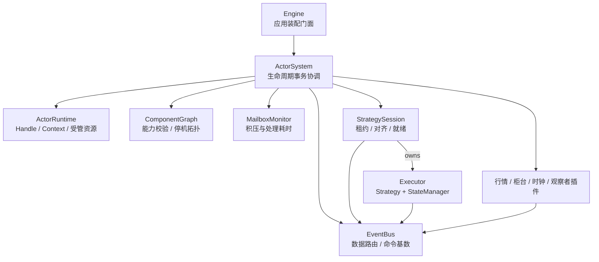
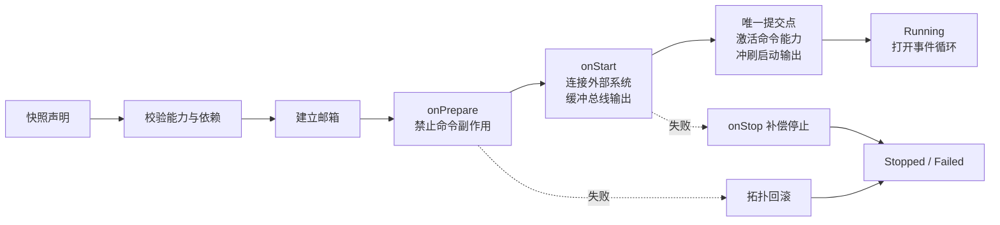

# 框架内核契约

框架内核只解决交易领域之外的共性问题：组件如何装配、依赖如何验证、资源归谁释放、失败如何变得可见。行情、柜台、策略、期权模型和撮合都属于插件，不进入内核分支。

## 全局模型

系统同时维护三张相互独立的图：

| 图 | 回答的问题 | 唯一事实来源 |
|---|---|---|
| 消息路由图 | 一条消息送给谁 | `Interest` 与 `EventBus` 索引 |
| 硬依赖图 | 缺少谁就不能正确运行 | `Actor.capabilities`、`commandHandlers` 与 `requirements` |
| 生命周期所有权树 | 谁负责停止、等待和释放谁 | `ActorContext.spawn/fork/manage` |

不能从其中一张图猜另一张图。订阅行情只代表想接收数据，不代表发布者必须存在；能够发布命令也无法从订阅声明中推导出来，因此硬依赖必须显式声明。父子关系表达所有权，不表达消息流。

## 最小接口

`Actor` 是唯一的组件形态：

- `interests` 声明输入消息。
- `commandHandlers` 声明本组件实际执行的命令，普通订阅不能冒充处理者。
- `capabilities` 声明存储、时钟等非消息能力；命令能力由 `commandHandlers` 自动派生。
- `requirements` 声明正确运行不可缺少的通用能力。
- `onPrepare` 只做可回滚的本地装配：登记资源、同步创建子组件。
- `onStart` 建立外部连接、创建受管任务和发起握手；总线输出留在事务缓冲区。
- `onEvent` 串行处理输入并产出消息。
- `onStop` 在依赖仍可用时完成最后业务收尾。

`ActorContext` 是组件唯一的运行能力入口：

- `publish/tell` 负责消息边界。
- `spawn` 建立父子所有权。
- `childSystem` 创建使用独立消息空间、但停机和失败都链接到本组件的子系统。
- `fork` 创建受管任务，停止时中断并限时等待。
- `reportFailure` 让异步协议在唤醒外部等待者之前同步报告终止失败，避免靠“稍后抛异常”的竞态传递。
- `manage` 登记外部资源，停止或启动回滚时逆序释放。
- `scheduleEvent` 创建归属于组件的延迟事件。终态后调用即抛；**停止会丢弃尚未到点的条目**，
  丢弃以 WARN 报出条数，不做静默处理 —— 需要保证送达的收尾输出放在 `onStop` 的返回值里。

组件不持有 `ActorSystem.stop`，因此不能越过监督者随意终止别的组件。插件需要的领域接口由插件自己定义，内核不提供交易客户端、行情接口或策略接口。

## 装配事务

批量装配遵循固定阶段：

1. 纯校验：检查能力提供者基数和全部硬依赖，生成 provider-first 启动拓扑，不产生订阅或启动副作用。
2. 接线：一次性为整批组件建立邮箱，使同批依赖与顺序无关。
3. 准备：执行 `onPrepare`；其中同步嵌套 `spawn` 的组件加入同一个事务。
4. 启动：按依赖拓扑执行 `onStart`，提供方先于依赖方、父组件先于子组件；事件循环、命令能力和总线输出仍不可见。
5. 提交：全部启动成功后，原子激活整批命令能力、冲刷启动输出并打开事件循环；失败则按拓扑补偿停止。

`onPrepare` 期间普通观察事件可以进入本地缓冲，但命令处理能力尚不可见，也禁止组件发布命令；准备失败可以完整回滚。`onStart` 可以连接外部系统、创建受管任务并发布握手命令，但总线输出会继续缓冲；只有整批钩子成功，处理能力与输出才在同一个提交点对外可见。因此外部线程不会把命令成功交给一个随后回滚的组件。同批组件的启动命令会在处理者激活后冲刷，外部 IO 则不可事务回滚，失败时由 `onStop` 补偿。清理错误作为 suppressed error 附到原始启动错误，根因不会被覆盖；某一项清理失败也不会跳过其余清理。

`onPrepare` 允许获取并登记可回滚资源和同步创建子组件，禁止发布 `CommandTopic`。`onPrepare` 与 `onStart` 产生的总线事件先缓存在所属组件，事务提交后才对总线可见；回滚则直接丢弃。仅让新组件邮箱排队并不足够，因为已经 Running 的策略可能把一条启动期行情立刻转成不可逆下单命令。

`onPrepare` 内的子组件装配必须由钩子线程同步完成；`onStart` 不再允许改变本次事务成员。组件进入 `Running` 后可以动态创建子组件，届时它是独立装配事务。

策略侧同样只有一棵所有权树：`StrategySession` 持有 `(账户, 标的)` 独占租约、对齐状态与 Executor 子组件。停止会话时先停 Executor 并发出撤单，再释放租约；隔离时资源不释放，租约自然保留。Engine 因此不读取 `ActorState` 推断是否释放 claim，也不再维护一套平行的对齐线程和回滚流程。

## 命令能力

普通 `Topic` 表示“发生了什么”，允许零到多个消费者。`CommandTopic` 表示“请做什么”，协议自身声明处理者基数：

- `ExactlyOne`：唯一副作用，例如下单或账户对齐。零个是静默失败，多个是重复执行。
- `AtLeastOne`：允许多个插件共同认领能力，例如同一交易所的不同行情源。

`CommandHandler` 是命令处理能力的唯一事实来源，同时建立投递和 capability。`Interest.All` 与
`Interest.Keyed` 都只是观察者，不算处理者；同一组件既观察又处理时，总线按邮箱身份去重，只投递一次。
因此监控、审计和测试探针无法因为订阅了一条命令就意外改变装配判定或执行基数。

`Capability` 把生命周期依赖从消息系统中解耦。数据库、状态存储、时钟或外部服务可以通过
`CapabilityProvider` 提供能力，由消费者用 `Requirement.capability` 声明依赖；装配器无需知道这些
模块的领域含义，也不需要去 EventBus 反查订阅者。

这些无领域含义的协议位于 `hft.kernel`。依赖方向固定为 `kernel <- event <- actor`；内核协议不反向
依赖消息总线或组件实现，避免组件与事件模块互相引用。

内核在三个时间点防守：

- 装配前：拒绝缺失或重复的处理者。
- 发布时：再次检查实际处理者基数，覆盖动态状态与框架外发布者。
- 动态停止前：若移除提供者会让存活组件丢失硬依赖，则在任何停止副作用之前拒绝。

## 停机与失败

组件状态为 `Wired -> Preparing -> Prepared -> Starting -> Running -> Stopping -> Stopped/Failed/Quarantined`，句柄公开当前状态、受管任务数、资源数和 `mailboxHealth`。邮箱健康快照包含当前积压、高水位、最老事件年龄上界、正在处理事件的持续时间、已处理数与处理耗时；内核按阈值统一告警，不把“慢但没抛异常”的静默失效留给每个插件自行发现。

停止一组组件时，系统从所有权树和硬依赖图计算拓扑顺序：依赖方先于提供方、子组件先于父组件；无约束节点才用逆装配序稳定排序。每个组件关闭并排空邮箱，执行 `onStop`，逆序释放资源，等待任务退出，最后从系统摘除。若所有权与依赖形成环，装配在运行副作用前失败，因为不存在满足契约的停机顺序。

`onPrepare`、`onStart`、事件循环、受管任务、`onStop`、资源释放和任务退出超时都不能静默失败。单组件停止超过宽限期时，错误包含组件状态、邮箱积压、in-flight 时长、受管任务标签和线程栈。Java interrupt 不能安全强杀不合作的插件，因此系统不会谎称它已经停止：组件进入 `Quarantined`，全部 Actor 输出立即熔断，尚未释放的资源、独占 claim 与依赖关系保留，不再继续拆除其依赖，整套系统拒绝新装配并 fail-fast 到进程退出。资源 cleanup 超时同样隔离，不能越过仍在执行的后登记 cleanup 并发释放更早资源。

隔离时的"进程退出"由装配层执行：`Engine.run` 在**停机之后的两条路径上**（正常返回与异常退出）都检查 `ActorSystem.isQuarantined`，见到即 `Runtime.halt`。两条都要查：停机期间发生的隔离可能不产生任何抛出（它若是系统的第一个失败，会被 `stopAll` 从聚合错误里滤掉），那时正常返回就会离开作用域并永久挂在 join 上。这一步不是可选的收尾动作——结构化并发保证离开并发作用域前 join 掉每一条 fork，而卡死那条永远不会退出，靠抛异常离开只会让进程挂在 join 上：既没停下来也没死掉，比直接死掉更糟。

**事件循环异常退出不在循环线程上跑 `onStop`。** 就地跑会让失败组件的收尾抢在它的子组件与依赖方之前，违反上面的停机拓扑（父会话在 `onEvent` 抛异常时，它的 `onStop` 会跑在子 Executor 之前）。异常退出时循环只做两件事：立刻摘掉邮箱（本组件的命令处理者随之从总线索引移除，依赖方随后发出的命令会在发布时以"处理者基数不足"报错，而不是静默排进一个再也不会被消费的邮箱），以及上报终态失败。`onStop` 改由有序停机按拓扑调度，`stopHookRun` 保证它只跑一次。

普通运行失败仍触发全系统有序停机；后续清理失败被聚合，但不会阻断其他组件收尾。内核不做局部自动重启，因为它无法替插件决定外部副作用和状态的接管语义。`Quarantined` 更不允许局部恢复：线程仍存在时，任何“替换成功”都是假的。

## 线程模型：一条也不在作用域之外

框架起的**每一条**线程都是构造 `ActorSystem` 的那个 `unsupervised` 块里的一条 ox fork（见 `ManagedTask`）：事件循环、`onPrepare`/`onStart`/`onStop` 钩子、资源释放、受管任务、延迟定时器、健康监督与停机监督。唯一的例外是 JVM 关闭钩子——`Runtime.addShutdownHook` 只接受 `java.lang.Thread`，且它跑在 JVM 关闭流程里、不属于任何并发作用域。

裸线程的生命周期只由创建它的代码记得去 join，而"忘了"没有任何症状。经作用域托管之后，"线程活过了它的所有者"从一类靠纪律避免的错误，变成结构上不可能。

用 `forkCancellable` 而不是 `fork`：组件失败不能就地炸穿作用域（那会跳过整段有序收尾），同时单个组件又必须能被定向取消。ox 的 `Fork.join()` 没有超时，而内核对每个钩子与任务的退出都有 `componentStopTimeoutMs` 上限，因此 `ManagedTask` 在 body 外套一层完成闸门与运行线程引用，给出有界等待与超时那一刻的栈。

**因此调用方也必须在作用域树内**：ox 只允许作用域树内的线程创建 fork。`spawn`/`spawnAll`/`stop`/`ActorContext.fork` 只能从创建作用域的那条线程、或该作用域（含子作用域）里的某条 fork 调用——也就是启动器自己，以及任何组件的钩子、事件循环与受管任务。从一条与作用域无关的裸线程调用会立刻失败并说明原因。

`ActorSystem` 实现 `AutoCloseable`，但 `close` 的意义是**有序停机**而非线程回收（后者由作用域负责）。顺序不能反：作用域退出会中断并 join 全部 fork，那时再跑 `onStop` 就晚了——撤单指令要在总线与柜台都还活着时发出。因此 `Engine.run` 把停机写在自己的 `finally` 里，而不是留给调用方的一行代码。

## 对插件的限制

- 外部资源必须用 `manage` 登记；常驻工作必须用 `fork`，不能创建脱离组件作用域的线程（裸 `Thread`、线程池、`Future` 都不行）。
- 常驻循环的等待必须用 `sleepUnlessStopped`，不能用裸 `Thread.sleep`：后者只能靠中断打断，于是每次停机都多一次"能不能按时退出"的不确定，超时就是 `Quarantined`。
- 私有消息空间必须用 `childSystem` 创建，不能自行创建一个失去失败链接的 `ActorSystem`。
- 正确运行必需的能力必须声明为 `Requirement`，不能等超时或空结果暴露。
- 命令必须使用 `CommandTopic`，不能用普通广播事件伪装副作用请求。
- `onPrepare/onStart/onEvent/onStop/release` 必须是有界操作；阻塞 IO 应放入受管任务并用 `manage` 登记关闭手段。失败必须向上传播，禁止捕获后丢弃。
- 新增领域能力通过新增 topic、actor 或领域接口完成，不在 `ActorSystem`/`EventBus` 增加交易品种分支。

因此期权字段不要求改 Actor 内核。IV、到期时间、行权价和希腊值属于期权插件的数据模型与 topic 载荷；内核限制的是组件行为的安全边界，不限制交易品种的字段集合。

但这不等于当前期权交易链路已经完整接通。现有 `MarketTopic -> SubscriptionKind` 仍依赖共享的封闭枚举；新增期权链、期权 ticker 或 IV surface 会要求修改这层插件协议。具体期权合约若不能由统一 `Instrument/Order/TradingGateway` 表达，也不能绕过 Gateway 直接 REST 下单。前者需要把订阅描述改成交易所插件可扩展协议，后者需要在交易插件层统一合约与回报模型；两者都不应向 `ActorSystem` 增加期权特判。
