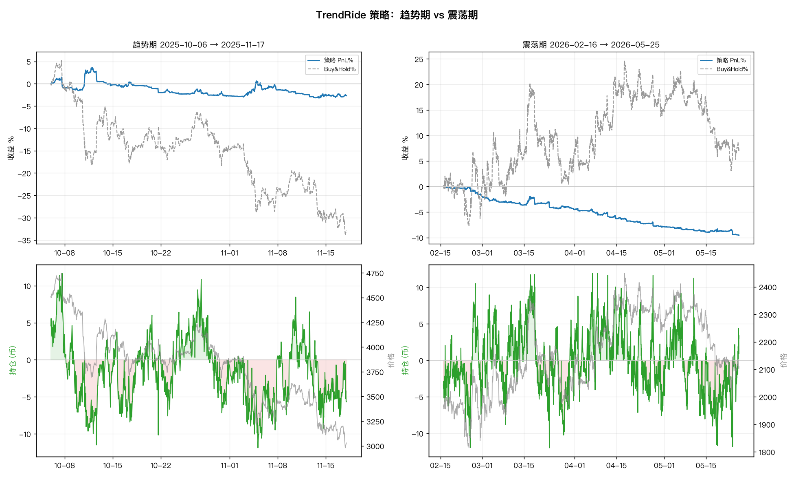

# TrendRide 策略：趋势期 vs 震荡期回测分析

> 策略设计见 `strategy/research/TrendRideLogic.scala` 顶部注释。本文是首版回测的客观结论，含**未达预期**的诚实记录。

## 1. 设计回顾（第一性原理）

仓位 = 信念的连续表达，由两本账叠加、信念安全带钳住：

- **动量账**：多周期 drift 带噪比（净位移 / σ√h，tanh 压缩）加权出信念 `C∈[-1,1]`，核心目标 `core = C·mMax`。
- **均值回归账**：短锚 stretch z-score，`−z·rMax`，高抛低吸。
- **信念安全带**：`C>0` 只允许净多、`C<0` 只允许净空、`|C|≈0` 对称轻仓 —— "绝不持大规模逆势仓"是**构造性**的。
- **执行**：顺势加仓/超买止盈走 maker；逆势/翻向走 taker 立即拍平反手。

## 2. 回测设置

- 标的 ETHUSDT 永续，trade-native 行情 + 零价差合成 BBO（`TradeBboAugmentSource`，使 taker 可成交，**低估真实点差成本**）。
- 资金 100k，maker 0.02% / taker 0.05%，每周期往前预热 8 天，正式区间起点重置基准净值。
- 周期：**趋势** 2025-10-06→11-17（ETH −33%）；**震荡** 2026-02-16→05-25。
- 原始数据：`/tmp/trendride/{trend,chop}_{equity,fills}.csv`；曲线 `docs/trendride/trendride_pnl.png`。

## 3. 结果

| 周期 | 策略收益 | Buy&Hold | 最大回撤 | 成交数 | 峰值仓位(币) | 平均仓位(币) |
|---|---|---|---|---|---|---|
| **趋势** | **−2.66%** | **−32.85%** | 6.5% | 4773 | 11.9 | 3.63 |
| **震荡** | **−9.53%** | +7.44% | 9.6% | 8173 | 12.0 | 3.30 |

> 数值为修复 code review Critical (taker 强平与撤单同拍并发, 非"先撤后吃") 后的结果。

## 4. 结论：风控达标，但 alpha 未兑现

### ✅ 达标：硬约束 #7 与下行保护

趋势期 ETH 暴跌 33%，策略**净值几乎走平（−2.8%）**。方向读对了：高价段平均持仓 −1.6 币、低价段 −3.2 币 —— **全程偏空、越跌越空**，没有在崩盘里扛大多单。设计的核心承诺"绝对不持大规模逆势仓位"兑现：最大回撤仅 6.7%，远小于 b&h 的 33%。

### ❌ 未达标：趋势里没赚到钱

方向对、却只做平，根因有二：

1. **趋势仓被均值回归账持续稀释**。短锚（6h）在单边趋势里几乎恒被"拉伸" —— 下跌时价持续低于短锚 → `z<0` → `−z·rMax>0` → 把空头目标往回拉。本该 `core≈−6` 的仓被 MR 拉到 `≈−2.4`。**用"短锚偏离"做超买超卖，在趋势里会系统性地与趋势对着干（追着抄底/逃顶）。**
2. **换手费拖累**。成交名义额 ~$1,120 万 → 费用区间 $2.2k–5.6k（占本金 2.2–5.6%）。空头毛利 ~$3.5k 基本被费用吃光。

### ❌ 震荡里持续失血（−9.8%）

- **假突破洗盘**：信念在区间内反复翻号 → taker 反手 → 在反转点站错边（后 1/3 价格上行时却平均持空 −1.7 币）。
- **费用**：~8200 笔成交，费用 $2.1k–5.3k，叠加洗盘亏损 → −9.5%。

## 5. 根因与改进杠杆（下一步）

| 问题 | 根因 | 杠杆 |
|---|---|---|
| 趋势仓被稀释 | MR 用过短的锚，趋势中恒"超买/超卖" | MR 规模随 `|C|` 衰减（高信念时几乎关掉抄底）；或 stretch 改用**更长公允值的偏离**而非 6h 锚 |
| 换手费高 | 不交易带过窄、taker 翻手频繁 | 加宽 band（按 σ 自适应）、信念加滞回（hysteresis）抑制频繁翻号、翻向用分批 taker 而非一次性 |
| 震荡洗盘 | 信念在区间内频繁翻号 | 用 ER/带噪比阈值识别"无趋势"→ 直接降杠杆/停动量账，只留极轻 MR 或空仓 |
| 趋势仓上不去 | 单边趋势里 σ 高 → 带噪比不饱和 → C 偏小 | 校准 `kSnr`、horizons、mMax；或对"持续同向"给信念加成 |

## 6. 一句话总结

**这版策略是一个合格的"风控/防崩盘"框架（趋势里把 −33% 变成 −3%），但还不是一个赚钱的趋势策略。** 均值回归账在趋势中反噬、换手费偏高是两大病灶，且都已定位到具体杠杆，可在不动架构的前提下调参/收敛解决 —— 符合"目标函数永不要求逆势仓、其余皆为可调系数"的设计初衷。
